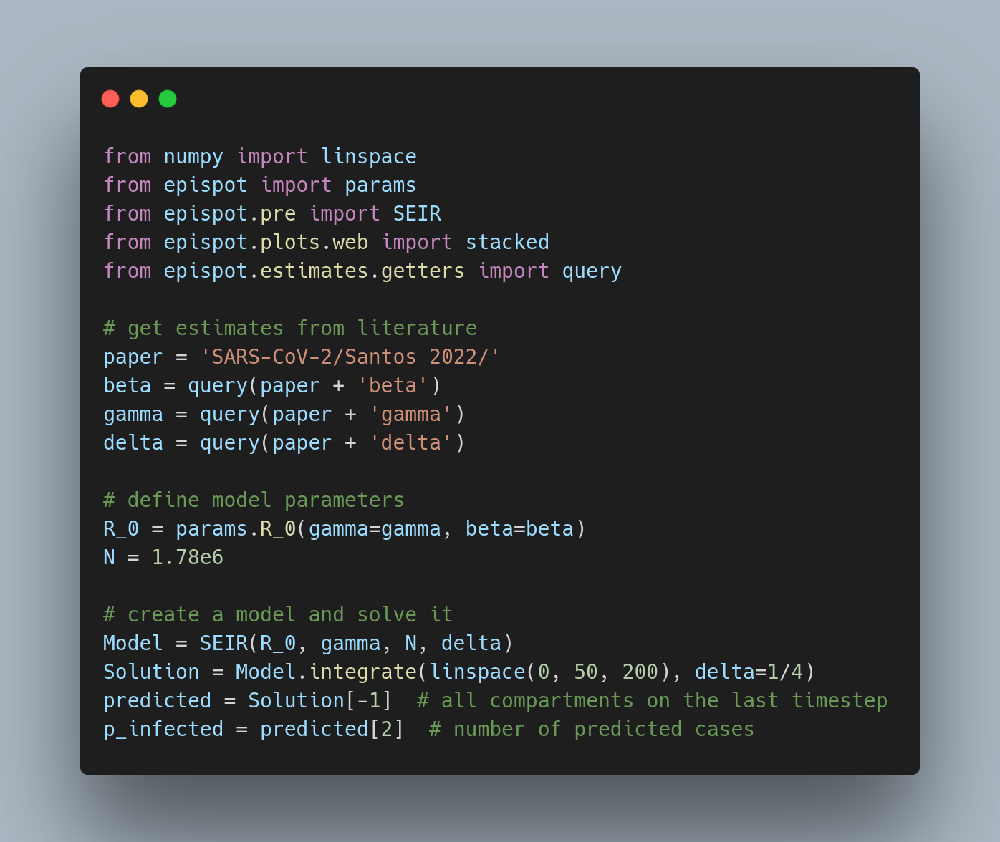

---

# epispot v3

A Python package for the mathematical modeling of infectious diseases via  compartmental models. Originally designed for epidemiologists, epispot can be adapted for almost any type of modeling scenario.

## Features

The epispot package currently only supports compartmental models, though we plan to expand the package to work for stochastic agent-based and spatial models as well. Currently, epispot offers the following:

- Quick compilation of compartmental models with the following compartments:
    - Susceptible
    - Infected
    - Recovered
    - Removed
    - Exposed
    - Dead
    - Critical
    - Hospitalized
- Custom-defined compartments for research
- Built-in graphing and visualization engine
    - Plots model predictions interactively
    - Creates comparisons between models

Due to its diverse range of features, epispot can be used for both research and experimental modeling. If you would like to add more modeling support, please see the [contributing section](#contributing).

## Installation

**Notice**: The epispot nightly package is now officially deprecated.

The epispot package can be installed from PyPI, Anaconda, or be built from the source. Below are the steps for each installation process:

### PyPI

This is the easiest way to install epispot. From a terminal, enter:

```shell
pip install epispot
```

### Anaconda

The standard version of epispot is published to `conda` using the `conda-forge` channel. To install, please use:

```shell
conda config --add channels conda-forge
conda install -c conda-forge epispot
```

### Building from the source

This is the hardest way to install epispot and it is recommended that you use either PyPI or Anaconda to install it instead. However, if you would like to contribute to the repository, this will be particularly useful.

Clone the repository and install the dependencies with:

```shell
git clone https://github.com/epispot/epispot
cd epispot
pip install -r requirements.txt
pip install -r bin/requirements.txt
```

Then, build the latest version with:

```shell
python setup.py install
```

For older releases, first checkout a version tag before installing; e.g.:

```shell
git checkout v2.1.1
python setup.py install
```

## Quick Demo

Using epispot in a Python REPL to create the well-known SIR model (in less than three lines of code):



## Documentation

Right now, documentation for some of the latest releases is quite shaky.
The official docs are located at <https://epispot.github.io/epispot/> but may be incomplete in many areas.

## Examples

The GitHub repository has a vast array of samples using epispot. We are currently working on a tutorial, but for now the [documentation](https://epispot.github.io/epispot/) is the best place to start.

## Badges

**PyPI**: 
[](https://pepy.tech/project/epispot)

**LGTM**: [](https://lgtm.com/projects/g/quantum9Innovation/epispot/context:python)
[](https://lgtm.com/projects/g/quantum9Innovation/epispot/alerts/)

**Codecov**: [](https://codecov.io/gh/epispot/epispot)

## Feedback

If you have any feedback, please

- Create a discussion on GitHub
- Create an issue if you've found a bug
- Submit a PR if you want to add a new feature
- Contact a [CODEOWNER](https://github.com/epispot/epispot/tree/master/.github/CODEOWNERS)

## Contributing

Contributions are always welcome!
See [CONTRIBUTING.md](https://github.com/epispot/epispot/tree/master/CONTRIBUTING.md) for instructions on how to get started, including environment setup and instructions to build from the source. Please note also that epispot has many guides dedicated to certain types of
contributions. Please see

- [DOCUMENTATION.md](https://github.com/epispot/epispot/tree/master/DOCUMENTATION.md) for documentation additions
- [SECURITY.md](https://github.com/epispot/epispot/tree/master/SECURITY.md) for epispot's security policy

## Citation

[](https://opensource.org/licenses/)

If you plan on using epispot in your project, please abide by the GPLv3 license. This requires that any changes you make to epispot are open-sourced under the GPLv3 license as well and that you give credit to the author, which you can do by citing the project in your research, linking back to the original repository, or mentioning the author @quantum9innovation.

For research, you can also use epispot's DOI to reference the project:
> [](https://zenodo.org/badge/latestdoi/280527664)

The recommended citation for epispot is:
> quantum9innovation (2022, August 20). epispot/epispot: (Version 3.0.0-rc-1).
> Zenodo. <http://doi.org/10.5281/zenodo.5136721>

## Related Work

There are many related projects to epispot, although we believe that epispot has greater extensibility than many of these other projects. Additionally, epispot is quite portable (graphs can be used as web components, displayed as images, etc.). However, below we would like to acknowledge a few projects that may be better suited to certain use cases:

- [EpiJS](https://github.com/Quantalabs/EpiJS) by @Quantalabs contains the same functionality of epispot but in pure JavaScript, making it more suitable for use in a web browser
- [covasim](https://github.com/institutefordiseasemodeling/covasim) by the [Institute for Disease Modeling](https://www.idmod.org) offers agent-based stochastic models as opposed to epispot's compartmental modeling structure
- [CovsirPhy](https://github.com/lisphilar/covid19-sir) by @lisphilar offers greater support for loading and analyzing real COVID-19 data instead of running simulations

## Authors

Please see our [CODEOWNERS](https://github.com/epispot/epispot/tree/master/.github/CODEOWNERS) file for authors. Because epispot is an open-source project, different pieces of our code have different authors. However, if citing epispot or using it in another project, you can cite @quantum9innovation as the lead author.

## Acknowledgements

### Idea & Inspiration

The original idea for epispot came from a [3Blue1Brown video](https://www.youtube.com/watch?v=gxAaO2rsdIs) on basic infectious disease dynamics and an [interactive article](https://www.washingtonpost.com/graphics/2020/world/corona-simulator/) in the Washington Post. This in turn inspired the very basic infectious disease dynamics simulated [here](https://quantum9innovation.github.io/disease/). However, what finally set the package into motion was a series of articles by Henry Froese, available on Medium
[here](https://towardsdatascience.com/infectious-disease-modelling-part-i-understanding-sir-28d60e29fdfc),
along with their corresponding interactive notebooks.

### Code Development & Maintenance

The epispot project is built on open source code and is itself open-source. The initial core development was fueled by @quantum9innovation and much of the codebase was maintained by @Quantalabs. Additionally, thank you to all of epispot's open-source contributors!


